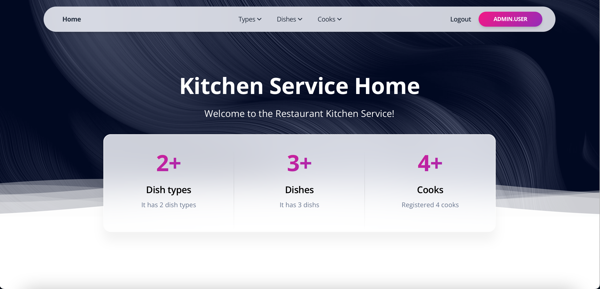

# Restaurant kitchen service

The project is designed to improve communication and rules among chefs in the kitchen. A management system is being created in which chefs can create new dishes and their types, as well as assign chefs responsible for preparing each dish.

## Installation

Python3 must be arleady installed


```shell
git clone https://github.com/PVS1905/restaurant-kitchen-service.git
cd restaurant-kitchen-service
python3 -m vevn venv
source venv/bin/activate
pip install -r requirements.txt
python manage.py runserver
```

### Features

Authentication functionality for Cook/user
Managing dishes cooks & dish types directly from website interface
Powerful admin panel for advanced managing


## Demo

